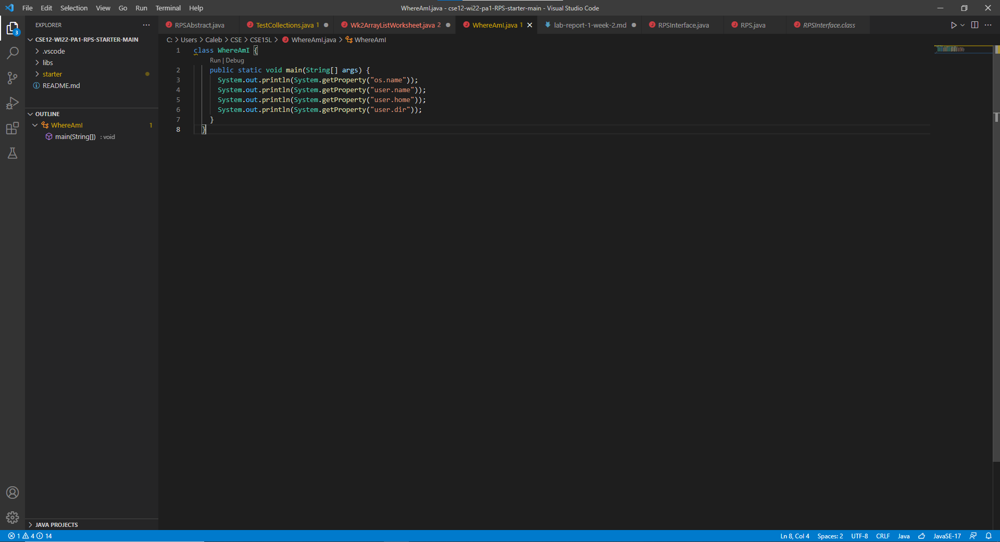
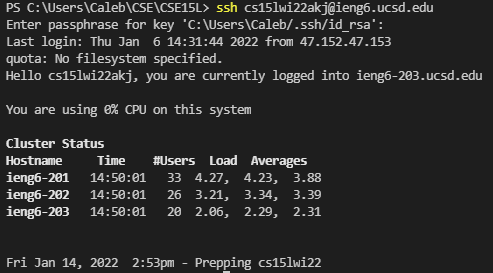
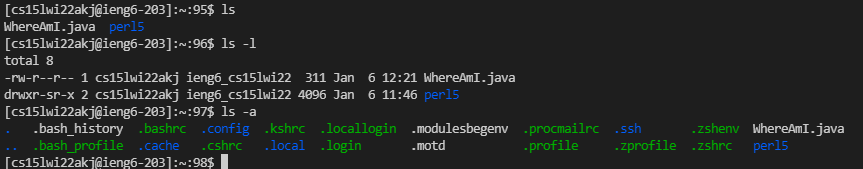
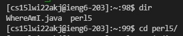
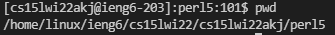
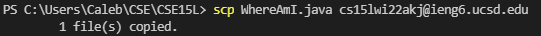
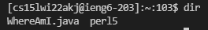
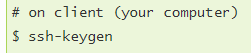
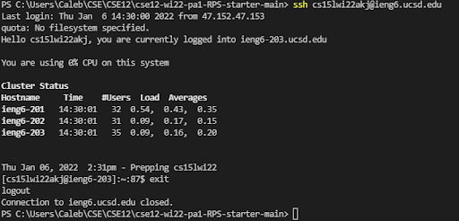
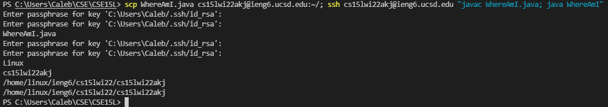

# Tutorial on remote access: 
## 1. Start by installing visual studio code.
\
While other IDEs work, for this tutorial, we will be using VS Code. You can also access the terminal through VSCode, which is what we will be using to connect to the remote server.
You can download VS Code here: [link](https://code.visualstudio.com/download)
## 2. To remotely connect to the server: 
First open the terminal. Then make sure you have downloaded OpenSSH.\
Then look up your account (which I did) and then type ssh [account name]@[server]. For me, it is ```ssh cs15lwi22akj@ieng6.ucsd.edu:\```

## 3. Now that we have connected, we can try some commands. 
```ls``` lists the files in the folder. You can add tags such as ```-l``` or ```-a``` \
\
```-l``` shows long listing files with more information and ```-a``` shows hidden files (dotfiles)\
Other commands like cd allow you to go into that directory,\
 Using ```dir``` shows the files in your current directory, just like ```ls```. We can see that we are now in folder perl5.\
 ```pwd``` shows directory.
## 4 Moving files
To move a file, you type ```scp [file to copy] [account name]@[server]:~\```
```~\``` indicates where the file goes. Right now, by leaving the specification empty, the file will be copied oo the home directory\
 \
 The file moved successfully: 
## 5. To not have to type in your password every time you connect, you can set up an SSH key:
To do so,\
\
NOTE: On [Windows](https://docs.microsoft.com/en-us/windows-server/administration/openssh/openssh_keymanagement#user-key-generation), there are extra steps\
Then you make an .ssh directory on your remote server and put the public key into there (public is the one with .pub at the end)\
The result should look like this (no password needed):\

## 6. Optimizing Remote Running:
To make it even faster, we can run local changes on the remote server in one command:\
\
The command ```scp WhereAmI.java cs15lwi22akj@ieng6.ucsd.edu:~/; ssh cs15lwi22akj@ieng6.ucsd.edu "javac WhereAmI.java; java WhereAmI"``` 
is like killing two birds with one stone. 
because this one command contains 4 keystrokes and saves a lot of time!\
The four keystroke we would have done are \
```scp WhereAmI.java cs15lwi22akj@ieng6.ucsd.edu:~/```\
```ssh cs15lwi22akj@ieng6.ucsd.edu```\
```javac WhereAmI.java```\
```java WhereAmI```\
Semicolons seperates these lines, allowing you to run multiple commands on the same line.\
You can also use the up arrow to recall your previously entered commands to make the process even faster!\
This further optimizes remote runnning and we remain on our own terminal.
