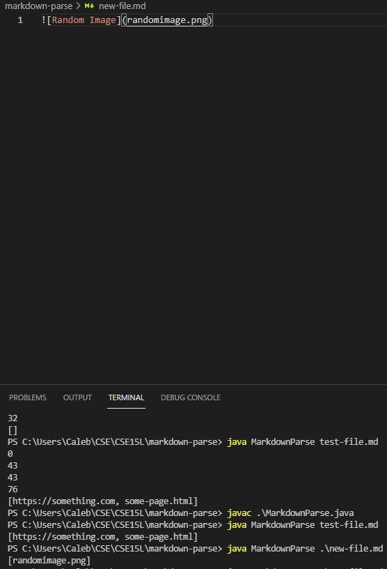
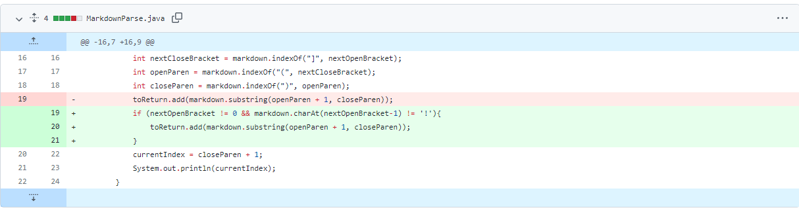
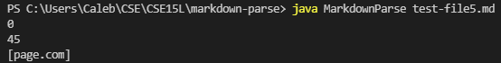
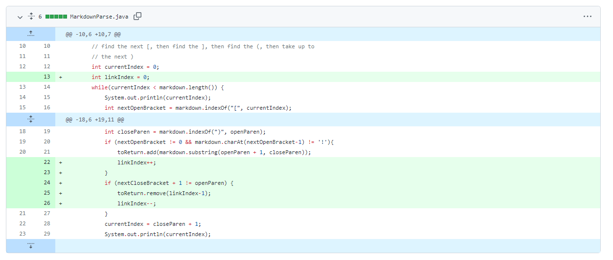
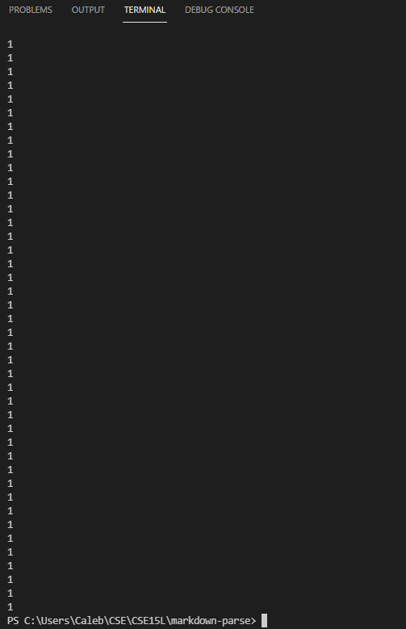
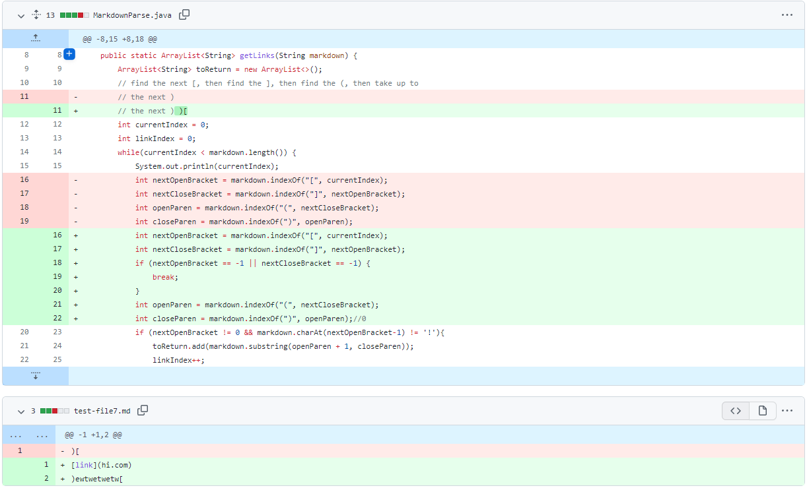

# Fixing bugs:
In [markdown-parse](https://github.com/catliba/markdown-parse), the code can be made better in several ways. 

* [Problem one](https://raw.githubusercontent.com/catliba/markdown-parse/main/new-file.md):
    * the program would still print out images inside the brackets, even though the expected output should only be links: 

    

    To fix the problem, we added an if statement that checks if there is a ```!``` before the open brackets within the new markdown file we created. The ```!``` indicates that it is an image and thus it will not print out.

    

    The failure inducing output printed out someimage.png. The symptom was that the program would print out pngs, but we don't want our program to do that. The bug was that the code did not know how to distinguish pngs and links since it only looks at [] and (). 

* [Problem two](https://raw.githubusercontent.com/catliba/markdown-parse/main/test-file5.md):
    * the program would still print out the file even though it is not supposed to, since there is a paragraph in between it. 
    It should look like ```[stuff](page.com)``` in order for it to be valid

    

    to fix this failure-inducing input, added a new check that if the index directly after the character ```]``` is not the character ```(```, then it would remove what it previously stored inside the array list as that is not the valid formatting of a link in a markdown file. 

    

    The failure inducing output printed out the link even if it was not implemented correctly:  ```[stuff](page.com)```. The symptom was that the program would still print out the links even if the format was not like that - as long as there is a bracket, and parenthesis. So, the bug was that the code did not look at what was directly after the end bracket and what was before the parenthesis to see if was it implemented correctly.

* [Problem three](https://raw.githubusercontent.com/catliba/markdown-parse/main/test-file7.md):
    * the program's expected output should be nothing, because no links are given. However, it prints out an infinite loop.

    

    To fix this, I added a check to see if the open or close brackets ever equaled ```-1``` which means that there are no more brackets in the string. This means that there is no point continuing the program as there are no more valid links within the list anymore.

    

    This failure inducing input was the infinite loop that repeats 1 infinitely. The bug was that the program take into account brackets and parenthesis as key characters since that is when it decides to check the index position, as it expects a link after those keywords. However, giving a random text file like above would cause a symptom to show up, since the code did not expect that format. 

The links to the github commit history can be found below: \
[Problem 1](https://github.com/catliba/markdown-parse/commit/ab7c784896f88c458dd058fbceeecdb76dfdf6a7) \
[Problem 2](https://github.com/catliba/markdown-parse/commit/4ce20aeeb47db0866b04e5b86cf3dc606b78683f) \
[Problem 3](https://github.com/catliba/markdown-parse/commit/13e88f95664f4df16010ad25d28f17e2f15244b0) 