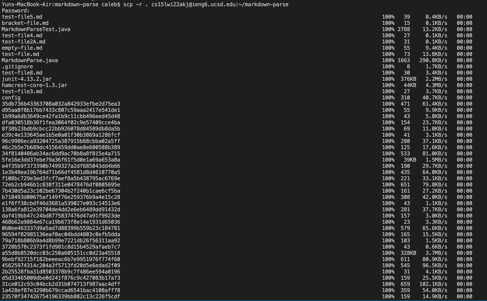
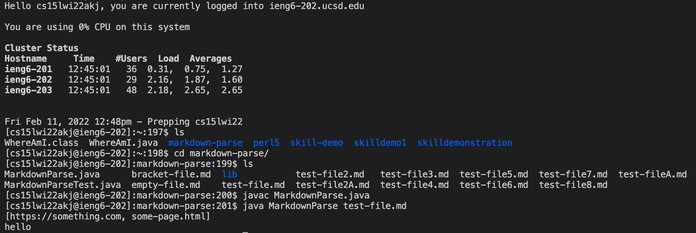
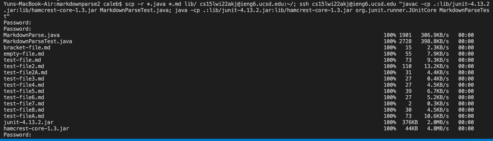
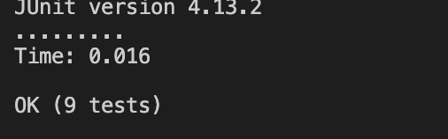

# Copying whole directories with ```scp -r```
It will be very convienient to copy over entire folders onto remote servers,
rather than ```scp``` individual files one by one - thats too time consuming.

To do so, we will let ```scp``` copy recursively, with:

```$ scp -r . cs15lwi22akj@ieng6.ucsd.edu:~/markdown-parse``` 
cs15lwi22akj is my account name. It should vary depending on your remote server access
 
```-r``` tells ```scp``` to work recursively.\
```.``` means the source, the currenty directory. You can also add certain files to copy over, for example:\
```scp -r *.java *.md /lib``` copies only files that end with ```.java```, ```.md``` and ```/lib```\
```~/markdown-parse``` tells ```scp``` to create/put the files in an existing ```markdown-parse``` directory on the remote server and then copy the current directory to there.

 Doing so, you copy all files onto the directory.\
 
This copied ALL files onto the a new markdown-parse folder, and we can run these programs.\


Now, we can run it all in one line.
Copying all the files we want and runnning the JUnit test.


