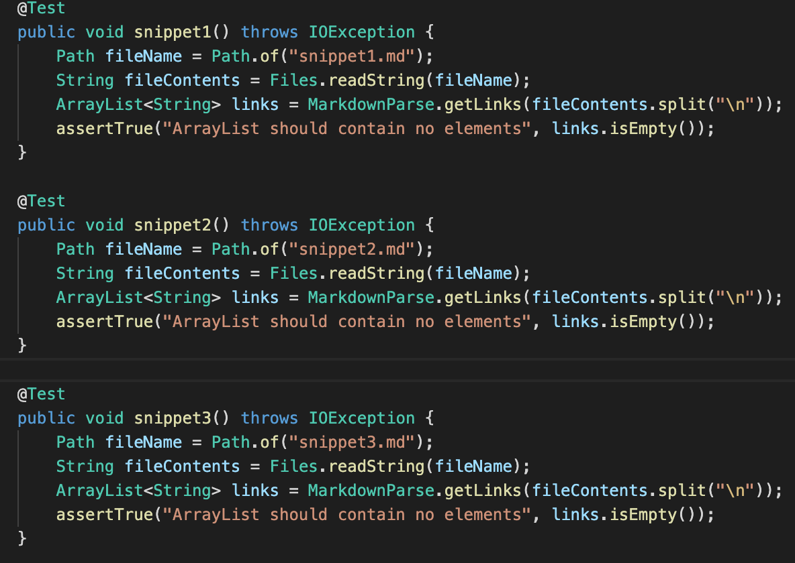
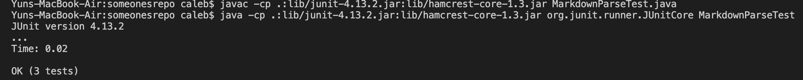
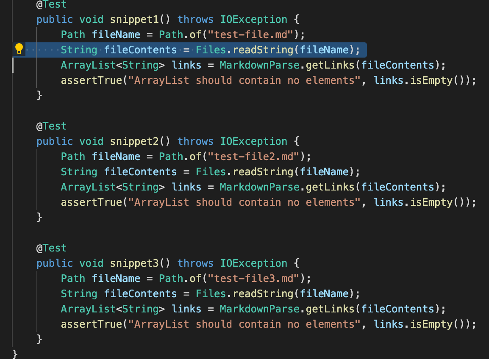
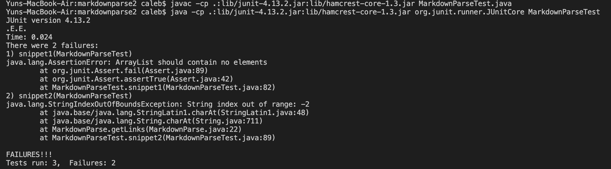

# Week 8 Lab Report
For each snippet, here are the expected outputs:

### Snippet 1: ```[]``` 
I believe that there should not be any backticks within link and their formmating, so nothing should be printed out.
### Snippet 2: ```[]``` 
I believe that nested brackets, and nested links should not work and this should print out nothing.
### Snippet 3: ```[]``` 
I believe that new lines is not proper formatting for links, so nothing should be outputted.

Since all of the test cases give the links with incorrect formatting,
the results should not produce incorrect link formatting, thus all of
them should be empty.

Their group's code:\
The JUnit test I used:
The output I got: 
Our group's (my) code:\
The JUnit test I used 
The output I got: 

The other group's implementation passed, but mine failed.

## Questions
*Do you think there is a small (<10 lines) code change that will make your program work for snippet 1 and all related cases that use inline code with backticks? If yes, describe the code change. If not, describe why it would be a more involved change.*

A check for backticks (<10 lines) could be added to my implementation of MarkdownParse. Similar to how I checked for other unwanted symbols in the link and the brackets before and if there is an exclamation point. If backticks are fine within the code, then you can do a String replace ` with empty string before printing and checking to see the validity of the link. If backticks are not okay, then if backticks exists within ```[Image](link.com)``` then do not print out the link.

*Do you think there is a small (<10 lines) code change that will make your program work for snippet 2 and all related cases that nest parentheses, brackets, and escaped brackets? If yes, describe the code change. If not, describe why it would be a more involved change.*

Yes. For unwanted symbols, you can do a simple if statement that checks if any of the parentheses, brackets, etc are in the link. If so, do not print out the link.

*Do you think there is a small (<10 lines) code change that will make your program work for snippet 3 and all related cases that have newlines in brackets and parentheses? If yes, describe the code change. If not, describe why it would be a more involved change.*

Yes, most likely. To check for newlines, I would have an if statment to see if there is a newline during the creation of the code. A newline may appear before the closed parentheses/brackets or after the open ones and by checking those location for newlines, you can decide whether or not to print the code. For my implementation, I believe that newlines should not be printed out. This should exceed 10 lines.


