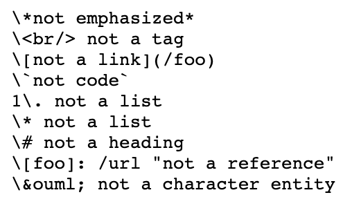
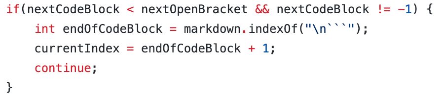
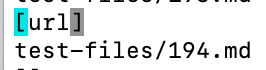
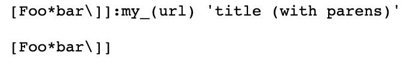
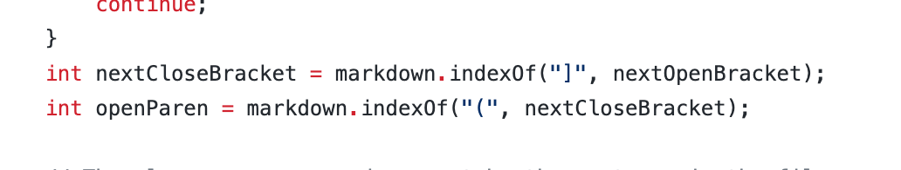

# Lab Report 5

Given numerous tests, here are the test cases that differed between two java programs. One of which is mine, and the other is Joe's. To find the differences in the results between mine and Joe's, I used the ```diff``` command, which "takes two files as arguments and shows their differences in a stylized format." The next two arguments following ```diff``` are the directories of the text files containing all the test's outputs. For mine, it was ```diff markdownparse-week9/results.txt someones-repo-markdownparse-week9/results2.txt``` but it varies depending on what your directories are called.
To get all 600+ outputs onto a file, I added ```bash script.sh > filename.txt```


## The two tests I will be comparing.
### Result for the 1st output differences 
```
{
91c90
< [/foo]
---
> []
}
```

This means that on line 91, Joe's mdparse outputted [/foo] while mine, at line 90, outputted [].

Code for file 14:


* *Describe which implementation is correct, or if you think neither is correct, by showing both actual outputs and indicating what the expected output is.*

I believe the output should output nothing because /foo is not a valid link. This means that my implementation is correct.

* *For the implementation that’s not correct (or choose one if both are incorrect), describe the bug (the problem in the code).*

Joe's of this is incorrect because it contains /foo, which is not a link. The bug is because their implemenation of MarkdownParse does not check for the actual contents within the link, it just finds the next ```[```, then find the ```]```, then find the ```(```, then take up to the next ```)```. To fix the code, we should check if the link is valid, with ways such as looking if there is a domain following the link like .com or .org etc. Also, special characters like / should not  be in the link, so in the code, there should be checks on that as well. Some place we can implement this fix in the code is here: 


### 2nd differences in outputs
```
{
211c210
< [url]
---
> []
}
```

On line 211, Joe's output resulted in ```[url]``` while on line 210, my output resulted in []. Going into their respective files, we can see that the problem occured in 194.md since lines 211 and 210 correspond to file 194.md. 

Here is what is in 194.md:


* *Describe which implementation is correct, or if you think neither is correct, by showing both actual outputs and indicating what the expected output is.*

I believe that the output should also not output anything. Looking at 194.md, the file is a mess with random colons and underscores. Links should be formatted in a specifc way, otherwise it should not be outputted. Thus, my implemenataion is correct while the other one is wrong, since nothing should be within the brackets.

* *For the implementation that’s not correct (or choose one if both are incorrect), describe the bug (the problem in the code).*

Since the code for Joe's printed out url, that means that it doesn't consider what's between the brackets and the parenthesis, but it should matter. The bug is at the part where the code checks the location of the brackets, it should add an if statement to see if the end bracket is followed by the open parenthesis. Some place we can implement this fix in the code is around here: 
